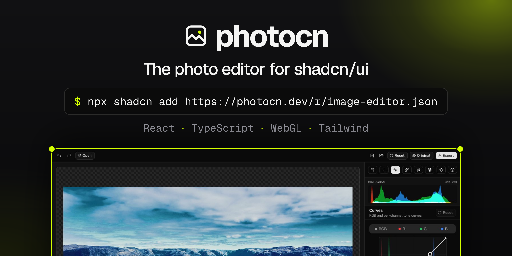
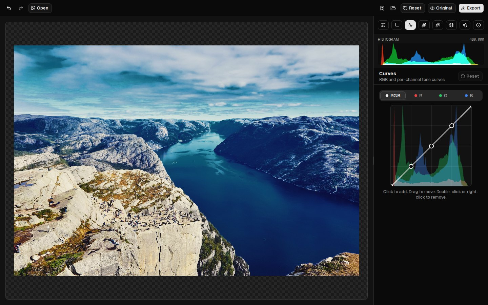
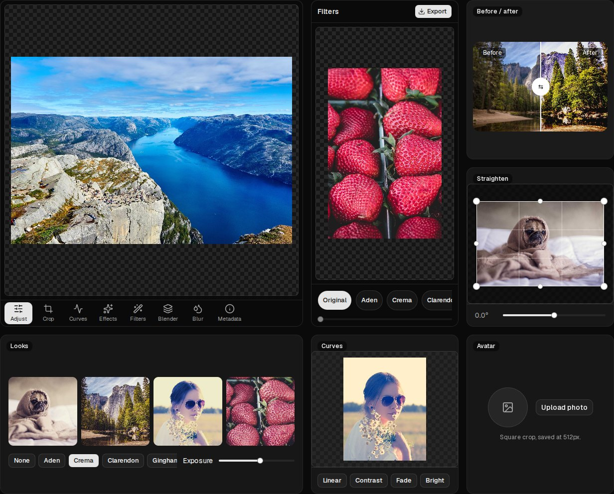
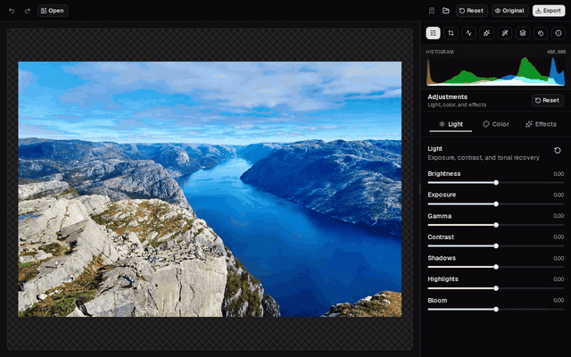

<h1 align="center">photocn</h1>

<p align="center">
  <strong>The photo editor for <a href="https://ui.shadcn.com">shadcn/ui</a>.</strong><br />
  Typed React components on a WebGL engine. Add the whole editor with one command, or compose your own.
</p>

<p align="center">
  <a href="https://photocn.dev/docs">Get Started</a> ·
  <a href="https://photocn.dev/docs/installation">Installation</a> ·
  <a href="https://photocn.dev/docs/canvas">Components</a> ·
  <a href="https://photocn.dev/blocks">Blocks</a>
</p>

<p align="center">
  
</p>

<table>
  <tr>
    <td width="62%"></td>
    <td width="38%"></td>
  </tr>
</table>

## Features

- 🎛️ **Adjustments**: light, color and effects, with undo and hold-to-compare
- 📈 **Curves**: RGB and per channel, over a live histogram
- 🎞️ **Filters**: 13 film-style looks with a strength slider
- ✂️ **Crop & transform**: straighten, perspective, rotate and flip, all reversible
- 🌫️ **Lens blur and blending**
- 📱 **Works on phones**: bottom tool bar, panels in a sheet, pinch to zoom
- 🧩 **Composable**: the full editor, any piece on its own, a headless hook, or `createPhoto()` without React
- ⚡ **Fast**: rendering runs in a Web Worker, so sliders stay smooth on large photos
- 💾 **Export**: PNG, JPEG (keeps EXIF) or WebP, at any size
- 🤖 **Agent-friendly**: [llms.txt](https://photocn.dev/llms.txt) and a markdown copy of every docs page

<table>
  <tr>
    <td></td>
    <td></td>
  </tr>
  <tr>
    <td align="center">Adjust</td>
    <td align="center">Crop &amp; transform</td>
  </tr>
</table>

## Install

photocn is built on the Base UI version of shadcn/ui (the default for new projects):

```bash
npx shadcn@latest init -b base
npx shadcn@latest registry add @photocn=https://photocn.dev/r/{name}.json
npx shadcn@latest add @photocn/image-editor
```

```tsx
import { ImageEditor } from "@/components/image-editor/image-editor";

export default function Page() {
  return <ImageEditor className="h-dvh" src="/photo.jpg" />;
}
```

## Use the pieces

Every panel, button and the canvas are separate components that read the nearest provider:

```tsx
<ImageEditorProvider src={file}>
  <ImageEditorCanvas />
  <ImageEditorFilters />
  <ImageEditorExportDialog onSave={({ blob }) => upload(blob)} />
</ImageEditorProvider>
```

Or skip the components and use the hook with your own UI:

```tsx
const editor = useImageEditorState({ src });
editor.filters.select("juno");
await editor.exportImage({ format: "webp", width: 1600 });
```

Or skip React entirely: `createPhoto()` gives you a stateful photo to edit and export.

```ts
import { createPhoto } from "photocn/photo";

const photo = await createPhoto(file);
photo.adjust({ exposure: 0.3, saturation: -1 }).filter("juno").aspectRatio("1:1");
const { blob } = await photo.export({ format: "jpeg", width: 1080 });
```

## Blocks

Ready-made editors you add with one command: [editor](https://photocn.dev/blocks#editor), [editor-minimal](https://photocn.dev/blocks#editor-minimal), [editor-mobile](https://photocn.dev/blocks#editor-mobile), [avatar-cropper](https://photocn.dev/blocks#avatar-cropper), [upload-editor](https://photocn.dev/blocks#upload-editor), [filter-picker](https://photocn.dev/blocks#filter-picker), [before-after](https://photocn.dev/blocks#before-after) and [batch-looks](https://photocn.dev/blocks#batch-looks).

```bash
npx shadcn@latest add @photocn/avatar-cropper
```

## Using with AI agents

- [`/llms.txt`](https://photocn.dev/llms.txt) lists every component and block, and [`/llms-full.txt`](https://photocn.dev/llms-full.txt) has every docs page in one file.
- Add `.md` to any docs URL (or send `Accept: text/markdown`) to get the page as markdown.
- The [home page](https://photocn.dev) has a **Copy prompt for your agent** button.

## Prior art

photocn started as an extraction and rewrite of [**mini-photo-editor**](https://github.com/xdadda/mini-photo-editor) by [xdadda](https://github.com/xdadda). Its WebGL filters, LUT looks and EXIF handling are the core of photocn's engine. The renderer descends from [glfx.js](https://github.com/evanw/glfx.js) by Evan Wallace, and EXIF parsing from [exif-js](https://github.com/exif-js/exif-js). All are MIT licensed; see [THIRD_PARTY_NOTICES.md](THIRD_PARTY_NOTICES.md).

The way it's distributed is inspired by [mapcn](https://github.com/AnmolSaini16/mapcn).

## Development

```bash
pnpm install
pnpm dev             # photocn (tsup --watch) + the site on :3000
pnpm test            # unit tests
pnpm --filter www test:e2e       # every block in a real browser
pnpm --filter www test:install   # shadcn-add every block into a fresh app
pnpm --filter www assets         # refresh screenshots, GIFs, banner and OG images
pnpm run deploy      # build and deploy photocn.dev (Cloudflare)
```

- `packages/photocn` is the npm package: the engine, `photocn/react` and `photocn/photo`.
- `apps/www` is the docs site and shadcn registry at photocn.dev. Registry source is in `apps/www/src/registry/`.
- Design notes: [docs/compose.md](docs/compose.md) explains how crop & transform work.

## Contributing

Issues and pull requests are welcome. See [CONTRIBUTING.md](CONTRIBUTING.md) for setup and checks.

## License

MIT. See [LICENSE](LICENSE). Demo photos are from Unsplash; see [CREDITS.md](CREDITS.md).
